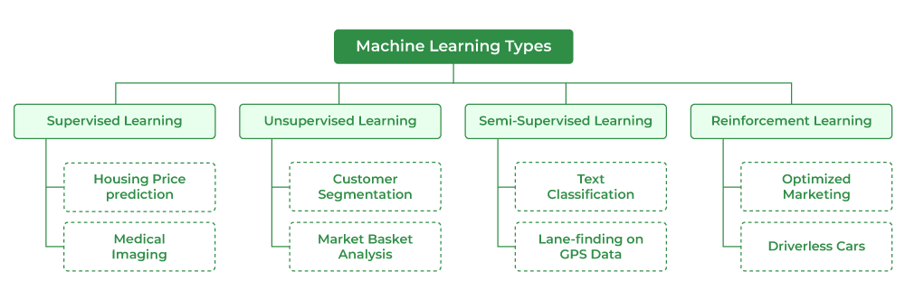

# Machine Learning

Machine learning algorithms are computational models that allow computers to understand patterns and forecast or make judgments based on data without the need for explicit programming.

## Types of Machine Learning Algorithms
There are three types of machine learning algorithms.

1. Supervised Learning
    - Regression
    - Classification
2. Unsupervised Learning
    - Clustering
    - Dimensionality Reduction
3. Reinforcement Learning

## Supervised Learning Algorithm

Supervised learning is a type of machine learning algorithms where we used labeled dataset to train the model or algorithms. The goal of the algorithm is to learn a mapping from the input data to the output labels, allowing it to make predictions or classifications on new, unseen data.

### Supervised Machine Learning Algorithms

1. Linear Model:
    - Regression
        1. Ordinary Least Square Regression
        2. Simple Linear Regression
        3. ultiple Linear Regression
        4. Polynomial Regression
        5. Orthogonal Matching Pursuit (OMP)
        5. Bayesian Regression
        6. Quantile Regression
        7. Isotonic regression
        8. Stepwise regression
        9. Least-angle regression (LARS)
    - Classification:
        1. Logistic Regression
        2. Sigmoid & Softmax functions
    - Regularization:
        1. Lasso (L1 Regularization)
        2. Ridge (L2 Regularization)
        3. Ridge regression
        4. Ridge Classifier
        5. Elastic Net
        6. LARS Lasso
2. K-Nearest Neighbors (KNN):
    1. Brute Force Algorithms
    2. Ball Tree and KD Tree Algorithms
    3. K-Nearest Neighbors (KNN) Classifier
    4. K-Nearest Neighbors (KNN) Regressor
3. Support Vector Machines:
    1. Support Vector Machines Classifier
    1. Support Vector Machines Regressor
    1. Different Kernel functions in SVM
4. Stochastic Gradient Descent
    1. Stochastic Gradient Descent Classifier
    2. Stochastic Gradient Descent Regressor 
    3. Different Loss functions in SGD
5. Decision Tree:
    - Decision Tree Algorithms
        1. Iterative Dichotomiser 3 (ID3) Algorithms
        2. C5. Algorithms
        3. Classification and Regression Trees Algorithms
    - Decision Tree Classifier
    - Decision Tree Regressor
6. Ensemble Learning:
    - Bagging (Bootstrap Aggregating)
        1. Random Forest
        2. Extra Trees
    - Boosting
        1. AdaBoost
        2. XGBoost
        3. CatBoost
        4. Gradient Boosting Machines (GBM)
        5. LightGBM
    - Stacking
7. Generative Model
    - Naive Bayes
        1. Gaussian Naive Bayes
        2. Multinomial Naive Bayes
        3. Bernoulli Naive Bayes
    - Gaussian Processes
        1. Gaussian Process Regression (GPR)
        2. Gaussian Process Classification (GPC)
    - Gaussian Discriminant Analysis
        1. Linear Discriminant Analysis (LDA)
        2. Quadratic Discriminant Analysis (QDA)
    - Bayesian Belief Networks
    - Hidden Markov Models (HMMs)
8. Time Series Forecasting:
    - Time Series Visualization and Analysis:
        1. Time Series Components: Trend, Seasonality, and Noise
        2. Time Series Decomposition Techniques
        3. Seasonal Adjustment and Differencing
        4. Autocorrelation and Partial Autocorrelation Functions
        5. Stationarity
        6. Augmented Dickey-Fuller Test
        7.  Seasonal Decomposition of Time Series (STL Decomposition)
        8. Box-Jenkins Methodology for ARIMA Models
    - Time Series Forecasting Algorithms:
        1. Moving Average (MA) and Weighted Moving Average
        2. Exponential Smoothing Methods (Simple, Double, and Triple)
        3. Autoregressive (AR) Models
        4. Moving Average (MA) Models
        5. Autoregressive Integrated Moving Average (ARIMA) Models
        6. Seasonal Decomposition of Time Series by Loess (STL)
        7. Seasonal Autoregressive Integrated Moving Average (SARIMA) Models
        8. ARIMAX and SARIMAX Models
9. Supervised Dimensionality Reduction Technique:
    - Linear Discriminant Analysis (LDA)